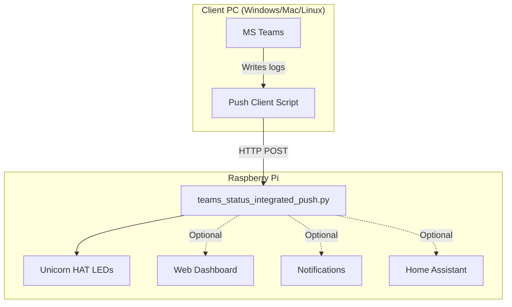

# MS Teams Presence Notification Light

Display your Microsoft Teams status on a Raspberry Pi with Unicorn HAT (8x8 RGB LED matrix). Uses a push architecture where your PC monitors Teams logs and pushes status updates to the Raspberry Pi.

<p align="center">
  
</p>

**Key Benefits:**
- No Microsoft Graph API required
- No Azure AD setup
- No admin permissions needed
- Works on restricted corporate networks

## Status Colors

| Status | Color | LED Display |
|--------|-------|-------------|
| Available | Green | Solid/animated green |
| Busy | Red | Solid/animated red |
| Away | Yellow | Solid/animated yellow |
| BeRightBack | Yellow | Solid/animated yellow |
| DoNotDisturb | Purple | Solid/animated purple |
| InAMeeting | Red | Solid/animated red |
| InACall | Red | Solid/animated red |
| Offline | Gray | Solid/animated gray |
| Unknown | White | Solid/animated white |

## Hardware Requirements

### Raspberry Pi (Server)
- Raspberry Pi 3 Model B+ (or Pi 2/4/Zero W)
- [Pimoroni Unicorn HAT](https://shop.pimoroni.com/products/unicorn-hat) (8x8 WS2812B RGB LEDs) - or see [Alternative Hardware](#alternative-hardware) section
- 5V 2.5A+ power supply
- MicroSD card with Raspberry Pi OS

### Client PC
- Microsoft Teams (New Teams or Classic)
- **Windows**: PowerShell 5.1+ (built into Windows)
- **macOS/Linux**: Python 3.7+ with `requests` module
- Network access to Raspberry Pi

## Quick Start

### 1. Raspberry Pi Setup

**Install dependencies:**
```bash
# Install Unicorn HAT library
curl -sS https://get.pimoroni.com/unicornhat | bash

# Clone this repo
git clone https://github.com/yourusername/MSTeams-Presence-Notify.git
cd MSTeams-Presence-Notify/raspberry_pi_unicorn

# Install Python dependencies
pip3 install -r requirements_integrated.txt
```

**Configure the server:**
```bash
# Copy the example config
cp config_push.yaml.example config_push.yaml

# Edit with your settings
nano config_push.yaml
```

**Configuration options (`config_push.yaml`):**
```yaml
server:
  port: 8080              # Port for receiving status from Windows PC

unicorn:
  brightness: 0.5         # LED brightness (0.0 to 1.0)
  animation_mode: "pulse" # solid, pulse, gradient, ripple, spinner

web:
  enabled: true           # Enable web dashboard
  host: "0.0.0.0"
  port: 5000              # Dashboard at http://<pi-ip>:5000

notifications:
  enabled: false          # Push notifications via ntfy.sh
  ntfy_topic: "my-unique-topic"

homeassistant:
  enabled: false          # MQTT integration for Home Assistant
```

**Start the server:**
```bash
sudo python3 teams_status_integrated_push.py
```

**Server Display:**
```
  +====================================================================+
  |           MS Teams Presence Server (Raspberry Pi)                  |
  +====================================================================+

  +--------------------------------------------------------------------+
  |  Configuration                                                     |
  +--------------------------------------------------------------------+
  |  Status Server Port: 8080        Web Dashboard: Enabled:5000       |
  |  Notifications: Disabled         Home Assistant: Disabled          |
  +--------------------------------------------------------------------+

  --------------------------------------------------------------------
  [OK] Server ready! Waiting for status updates...
  Press Ctrl+C to stop
  --------------------------------------------------------------------

  15:36:48  [OK]  Status: Available
  15:42:15  [!!]  Status: Busy
```

### Auto-Start on Boot (systemd)

Create a systemd service to automatically start the server when the Raspberry Pi boots:

**1. Create the service file:**
```bash
sudo nano /etc/systemd/system/teams-presence.service
```

**2. Add the following content:**
```ini
[Unit]
Description=MS Teams Presence LED Server
After=network.target

[Service]
Type=simple
User=root
WorkingDirectory=/home/pi/MSTeams-Presence-Notify/raspberry_pi_unicorn
ExecStart=/usr/bin/python3 /home/pi/MSTeams-Presence-Notify/raspberry_pi_unicorn/teams_status_integrated_push.py
Restart=always
RestartSec=10

[Install]
WantedBy=multi-user.target
```

> **Note:** Adjust the paths if your installation directory is different.

**3. Enable and start the service:**
```bash
# Reload systemd to recognize the new service
sudo systemctl daemon-reload

# Enable auto-start on boot
sudo systemctl enable teams-presence.service

# Start the service now
sudo systemctl start teams-presence.service

# Check status
sudo systemctl status teams-presence.service
```

**4. Useful commands:**
```bash
# View live logs
sudo journalctl -u teams-presence.service -f

# Restart the service
sudo systemctl restart teams-presence.service

# Stop the service
sudo systemctl stop teams-presence.service

# Disable auto-start
sudo systemctl disable teams-presence.service
```

### 2. Client Setup

#### Windows (PowerShell)

```powershell
cd powershell_service

# Run with default settings (edit the script to change IP)
powershell -ExecutionPolicy Bypass -File TeamsPushClient.ps1

# Or specify parameters
powershell -ExecutionPolicy Bypass -File TeamsPushClient.ps1 -RaspberryPiIP "192.168.1.100" -Port 8080 -PollInterval 5

# Enable debug output for troubleshooting
powershell -ExecutionPolicy Bypass -File TeamsPushClient.ps1 -Verbose
```

**Parameters:**
| Parameter | Default | Description |
|-----------|---------|-------------|
| `-RaspberryPiIP` | 192.168.50.137 | IP address of your Raspberry Pi |
| `-Port` | 8080 | Port number for the Pi server |
| `-PollInterval` | 5 | Seconds between status checks |
| `-Verbose` | Off | Enable debug output for troubleshooting |

#### macOS (Python) - Experimental

> **Note:** The macOS client is untested and may require adjustments for your Teams installation.

```bash
cd mac

# Install dependency
pip3 install requests

# Run the client
python3 TeamsPushClient.py --ip 192.168.1.100 --port 8080 --interval 5
```

**Parameters:**
| Parameter | Default | Description |
|-----------|---------|-------------|
| `--ip` | 192.168.50.137 | Raspberry Pi IP address |
| `--port` | 8080 | Server port |
| `--interval` | 5 | Poll interval in seconds |
| `--verbose` | Off | Enable debug output |

**Log locations checked:**
- New Teams: `~/Library/Containers/com.microsoft.teams2/Data/Library/Application Support/Microsoft/MSTeams/Logs`
- Classic Teams: `~/Library/Application Support/Microsoft/Teams/Logs`

#### Linux (Python) - Experimental

> **Note:** The Linux client is untested and may require adjustments for your Teams installation.

```bash
cd linux

# Install dependency
pip3 install requests

# Run the client
python3 TeamsPushClient.py --ip 192.168.1.100 --port 8080 --interval 5
```

**Parameters:** Same as macOS client above.

**Log locations checked:**
- New Teams: `~/.local/share/Microsoft/Teams/Logs`
- Classic Teams: `~/.config/Microsoft/Microsoft Teams/logs.txt`
- Snap: `~/snap/teams/current/.config/Microsoft/Microsoft Teams/logs.txt`
- Flatpak: `~/.var/app/com.microsoft.Teams/config/Microsoft/Microsoft Teams/logs.txt`

### Client Display

All clients show a fixed, non-scrolling display that updates in-place:

```
  ======================================================================
                    MS Teams Status Push Client
  ======================================================================

  ----------------------------------------------------------------------
   Configuration
  ----------------------------------------------------------------------
   Raspberry Pi:  192.168.50.137     Port: 8080
   Poll Interval: 5s

  ----------------------------------------------------------------------
   Raspberry Pi Services
  ----------------------------------------------------------------------
   Web Dashboard:   http://192.168.50.137:5000
   Status API:      http://192.168.50.137:8080/status
   Home Assistant:  MQTT (configure on Pi)
   Notifications:   ntfy.sh (configure on Pi)

  ----------------------------------------------------------------------
   Current Status
  ----------------------------------------------------------------------
   [OK] Available       Last update: 15:36:48

  ----------------------------------------------------------------------
   Recent Changes
  ----------------------------------------------------------------------
   15:36:48  [OK] Available      -> Pi [Sent]
   15:30:12  [!!] Busy           -> Pi [Sent]
   15:28:45  [OK] Available      -> Pi [Sent]
   -
   -

  ----------------------------------------------------------------------
   Connection: Connected      Updates sent: 3
  ----------------------------------------------------------------------

  Last poll: 15:36:53  |  Next in:  3s  |  Ctrl+C to stop
```

### Auto-Start on Windows Login

1. Create a `.bat` file (e.g., `StartTeamsMonitor.bat`):
```batch
@echo off
powershell -ExecutionPolicy Bypass -WindowStyle Minimized -File "C:\path\to\TeamsPushClient.ps1" -RaspberryPiIP "192.168.1.100"
```

2. Add to Windows Startup folder:
   - Press `Win+R`, type `shell:startup`, press Enter
   - Copy your `.bat` file to this folder

## Project Structure

```
MSTeams-Presence-Notify/
├── powershell_service/
│   └── TeamsPushClient.ps1      # Windows client - monitors Teams & pushes status
├── mac/
│   └── TeamsPushClient.py       # macOS client (experimental)
├── linux/
│   └── TeamsPushClient.py       # Linux client (experimental)
├── raspberry_pi_unicorn/
│   ├── teams_status_integrated_push.py  # Pi server - receives status & controls LEDs
│   ├── config_push.yaml.example         # Example configuration
│   └── requirements_integrated.txt      # Python dependencies
└── README.md
```

## Features

### Unicorn HAT Display
- 8x8 RGB LED matrix (64 individually addressable LEDs)
- Multiple animation modes: solid, pulse, gradient, ripple, spinner
- Adjustable brightness

### Web Dashboard (Optional)
- Mobile-friendly status display
- Access at `http://<pi-ip>:5000`
- Real-time status updates

### Push Notifications (Optional)
- Uses [ntfy.sh](https://ntfy.sh) for free push notifications
- Receive status change alerts on your phone
- Subscribe to your topic in the ntfy app

### Home Assistant Integration (Optional)

Integrate with Home Assistant via MQTT for smart home automation based on your Teams presence.

**1. Prerequisites:**
- Home Assistant with MQTT broker (Mosquitto add-on recommended)
- MQTT integration configured in Home Assistant

**2. Configure the Raspberry Pi:**

Edit `config_push.yaml` on the Raspberry Pi:

```yaml
homeassistant:
  enabled: true
  mqtt_broker: "homeassistant.local"  # Your HA hostname or IP
  mqtt_port: 1883
  mqtt_username: "mqtt_user"          # Your MQTT username
  mqtt_password: "mqtt_password"      # Your MQTT password
  mqtt_topic: "homeassistant/sensor/teams_presence"
  discovery_prefix: "homeassistant"
```

**3. Restart the service:**
```bash
sudo systemctl restart teams-presence.service
```

**4. Verify in Home Assistant:**

The sensor `sensor.teams_presence_status` will auto-discover via MQTT. Check:
- **Settings** > **Devices & Services** > **MQTT** > **Entities**

**5. Example Automations:**

```yaml
# Turn on office light when Available
automation:
  - alias: "Teams Available - Office Light On"
    trigger:
      - platform: state
        entity_id: sensor.teams_presence_status
        to: "Available"
    action:
      - service: light.turn_on
        target:
          entity_id: light.office

# Turn on DND light when in meeting
  - alias: "Teams Busy - DND Light"
    trigger:
      - platform: state
        entity_id: sensor.teams_presence_status
        to: "Busy"
    action:
      - service: light.turn_on
        target:
          entity_id: light.dnd_indicator
        data:
          color_name: red
```

**Available States:** `Available`, `Busy`, `Away`, `BeRightBack`, `DoNotDisturb`, `InAMeeting`, `InACall`, `Offline`, `Unknown`

## Alternative Hardware

Don't have a Unicorn HAT? The Raspberry Pi server accepts standard HTTP POST requests, making it easy to adapt for other hardware.

### Using Other LED Hardware on Raspberry Pi

**Blinkt! (8 RGB LEDs):**
```bash
curl -sS https://get.pimoroni.com/blinkt | bash
```
Modify the server to use `import blinkt` instead of `unicornhat`.

**NeoPixel Strip/Ring:**
Use the `rpi_ws281x` library. Example for a 16-LED ring:
```python
from rpi_ws281x import PixelStrip, Color
strip = PixelStrip(16, 18)  # 16 LEDs on GPIO 18
strip.begin()
```

**Single RGB LED:**
Wire an RGB LED to GPIO pins and use `RPi.GPIO` to control colors.

### Using ESP32/ESP8266

Create a simple HTTP server that receives the same JSON payload:

```cpp
// Arduino/ESP32 example endpoint
server.on("/status", HTTP_POST, []() {
  String body = server.arg("plain");
  // Parse JSON: {"availability":"Busy","color":"#FF0000"}
  // Set LED color based on payload
});
```

Popular options:
- **ESP32 with NeoPixel**: WiFi-enabled, low power
- **ESP8266 (Wemos D1 Mini)**: Cheap, easy to program
- **Arduino with Ethernet Shield**: Wired connection option

### Using Other Single-Board Computers

Any device that can:
1. Run a Python HTTP server
2. Control GPIO or addressable LEDs

Will work with minimal modification. Options include:
- **Orange Pi** / **Banana Pi**: Pin-compatible with Raspberry Pi
- **BeagleBone**: Good GPIO support
- **NVIDIA Jetson Nano**: Overkill but works

### API Endpoint

The server exposes a simple REST API. To integrate with any hardware:

```bash
# POST to /status with JSON body
curl -X POST http://<pi-ip>:8080/status \
  -H "Content-Type: application/json" \
  -d '{"availability":"Busy","activity":"InAMeeting","color":"#FF0000"}'

# GET current status
curl http://<pi-ip>:8080/status
```

**JSON Payload:**
```json
{
  "availability": "Busy",
  "activity": "InAMeeting",
  "color": "#FF0000",
  "timestamp": "2024-01-15T10:30:00"
}
```

## Architecture



## Troubleshooting

### PowerShell Client (Windows)
| Issue | Solution |
|-------|----------|
| Teams log not found | Ensure Teams is running. The client checks both New Teams and Classic Teams log locations. |
| Cannot connect to Pi | Check firewall settings, verify Pi IP address, ensure Pi is on the same network. |
| Status always "Unknown" | Run with `-Verbose` flag to see debug output and matched log patterns. |
| Connection shows "Disconnected" | Verify the Pi server is running: `sudo systemctl status teams-presence.service` |

### Python Client (macOS/Linux)
| Issue | Solution |
|-------|----------|
| Module not found | Install requests: `pip3 install requests` |
| Teams log not found | Teams on Linux/macOS may use different log locations. Run with `--verbose` to debug. |
| Permission denied | Some log locations may require read permissions. |

### Raspberry Pi
| Issue | Solution |
|-------|----------|
| LEDs not lighting | Ensure Unicorn HAT is properly seated on GPIO. Script must run with `sudo`. |
| Web dashboard not accessible | Check firewall (`sudo ufw allow 5000`), verify port 5000 is enabled in config. |
| Permission denied | The script requires root to access GPIO: `sudo python3 teams_status_integrated_push.py` |
| Service won't start | Check logs: `sudo journalctl -u teams-presence.service -n 50` |

### Network
| Issue | Solution |
|-------|----------|
| Connection refused | Verify Pi IP address (`hostname -I`) and ensure port 8080 is open. |
| No status updates | Ensure both devices are on the same network/VLAN. Check Windows firewall outbound rules. |
| Intermittent connection | Check for IP address changes. Consider setting a static IP on the Pi. |

## How It Works

1. **Teams writes status to local log files** - Teams continuously updates log files with presence information
2. **Client monitors logs** - The client reads the last 5000 lines of the newest Teams log every 5 seconds
3. **Status parsed via regex** - Looks for patterns like `availability: Available`, `SetBadge status`, etc.
4. **HTTP POST to Raspberry Pi** - When status changes, sends JSON: `{"availability":"Busy","activity":"Busy","color":"#FF0000"}`
5. **Pi updates LED display** - Changes the Unicorn HAT color and animation based on received status

## License

MIT License - See LICENSE file for details.

## Contributing

Contributions welcome! Please open an issue or submit a pull request.
